# SCALA DID

A Scala/ScalaJS library for DID and DIDcomm.
The one of the main goals of this library is to make DID Comm v2 **type safety** and easy to use.
Made for developers by developers.

[**LIVE DEMO (DIDComm's Sandbox)**](https://did.fmgp.app/)

[**Scala-DID Documentation**](./docs/readme.md)

 - **CI** automate builds and tests all pushes to the master branch also as all PRs created.
 - **Scala Steward** automate the creation of pull requests for libraries with updated dependencies, saving maintainers time and effort. It can also help ensure that libraries are kept up-to-date, improving their reliability and performance.

The future version of [**DID Comm v2.1**](https://identity.foundation/didcomm-messaging/spec/v2.1/) is been track&develop in the branch [`didcomm-v2.1`](https://github.com/FabioPinheiro/scala-did/tree/didcomm-v2.1)

**More documentation:**
- [LICENSE](LICENSE) - Apache License, Version 2.0
- [did implementations](did-imp/README.md) = Notes and TODO list
- [example](did-example/README.md) - just a set of DIDs for experiments.
- [demo](demo/README.md) - How to build, test and deploy the Demo. The Demo is a server with (webapp) client.  
- [webapp module](webapp/README.md) - How to build, develop and run localy.
- [multiformats module](multiformats/README.md) - Implemente notes and an considerations (of TODOs) if we want to use as the independent Library.
- [docs](docs/) - Base folder of the library documentation website.
  - [docs/readme.md - **Scala-DID Documentation**](docs/readme.md)

## Adopters

Following is a partial list of companies and project using DID Comm to craft applications.

Want to see your project here? [Submit a PR]

- [DID Comm - Playground](https://did.fmgp.app/)
- [DID Comm Action - Send messages from Github jobs](https://github.com/fabiopinheiro/did-comm-action)
- [PRISM](https://atalaprism.io/)
  - [DID Comm Mediator](https://github.com/input-output-hk/atala-prism-mediator)

## DID Comm - Protocols

See specifications of the implemented [DID Comm Protocols](./docs/src/03-reference/01-didcomm-protocols.md)

## TODO/WIP

- We are still working on core API.
  - decrypting a file MUST be one of the following combinations: [See this like](https://identity.foundation/didcomm-messaging/spec/#iana-media-types)
- [TODO!] [Message Layer Addressing Consistency](https://identity.foundation/didcomm-messaging/spec/#message-layer-addressing-consistency)
- did-rotation: https://identity.foundation/didcomm-messaging/spec/#did-rotation
  - support `from_prior`
  - support `sub` `iss` on JWT https://datatracker.ietf.org/doc/html/rfc7519
- maybe implement method `did:peer.3` and `did:peer.4`
- [TODO] method `did:key`
- maybe implement method `did:jwk` https://github.com/quartzjer/did-jwk
- maybe implement methods ["KERI lite"](https://docs.google.com/presentation/d/1ksqVxeCAvqLjr67htWZ4JYaSnI8TUZIO7tDMF5npHTo/edit#slide=id.g1ca1fd90f33_0_0)
- be part of the Adopters in https://github.com/sbt/sbt-ci-release/
- Remove field `kty` from `ECPublicKey` and `OKPPublicKey`. Make custom json encoder/decoder
- FIXME The encoder for ProtectedHeader MUST not have the field "className"

## Benefits of type safety

- It would help prevent errors by ensuring that only valid DIDs are used, and that the library does not attempt to perform any invalid operations on them. This could help ensure that the library functions correctly and reliably.

- It would make the code easier to read and understand, by making it clear what types of values are being used and what operations are being performed on them. This could make it easier for developers to work with the library and understand its functionality. **Speeding up the development of applications**

- It could make the library more efficient, by allowing the compiler to optimize the code for working with DIDs. This could make the library run faster and more efficiently.

- It could improve the reliability and correctness of the library, by catching any errors or bugs related to invalid DIDs or invalid operations at compile time. This could save time and effort in the development process and help prevent potential issues in the final library.

I usually say if it compiles it probably also works! 

## Project Structure and Dependencies Graph

```mermaid
flowchart BT

  zhttp --> zio
  did --> zio
  zio-json --> zio
  did --> zio-json
  did-resolver-web ----> zhttp:::JVM

  subgraph fmgp libraries
    did-resolver-peer --> multibase
    subgraph platform specific
      did-imp
      did-imp-hw:::Others -.-> did-imp
      did-imp_js:::JS ==>|compiles together| did-imp
      did-imp_jvm:::JVM ==>|compiles together| did-imp
    end
    did-resolver-web --> did
    did-resolver-peer --> did
    did-resolver-prism ---> did
    did-comm-protocols --> did
    did-framework --> did
    did-framework --> did-comm-protocols
    did-imp --> did
  end

  prism-node:::JVM -----> did-resolver-prism

  did-example ----> did
  did-example --> did-imp
  demo --> did-imp 

  did-imp_jvm:::JVM ----> nimbus-jose-jwt:::JVM --> google-tink:::JVM
  did-imp_jvm:::JVM ---> google-tink

  did-imp_js ----> jose:::JS

  %% subgraph demo/docs
    webapp:::JS --> did-framework
    demo --> did-framework
    demo --> did-resolver-web
    demo --> did-resolver-peer
    webapp:::JS --> did-imp_js
    webapp:::JS  --> did-resolver-web
    webapp:::JS  --> did-resolver-peer
    webapp:::JS  --> did-example
    demo  --> did-example
    demo -.->|uses\serves| webapp

    demo_jvm(demo_jvm\nA server):::JVM ==>|compiles together| demo

    did-example  --> did-resolver-peer
    did-example  --> did-resolver-web
  %% end

  classDef JVM fill:#141,stroke:#444,stroke-width:2px;
  classDef JS fill:#05a,stroke:#444,stroke-width:2px;
  classDef Others fill:#222,stroke:#444,stroke-width:2px,stroke-dasharray: 5 5;

```

NOTES:

- The things inside the group box (fmgp) are implemented on this repository and that are intended to be published as a library.
- Green boxes is JVM's platform specific.
- Blue boxes is JavaScript's platform specific.
- Other boxes are not platform specific.
- The `did-imp-hw` is a idea how to extend for other implementation. Like a hardware/platform specific or with hardware wallet support.
- `did-resolver-web` & `did-resolver-peer` & `did-resolver-prism` are implementations of the respective did methods.

