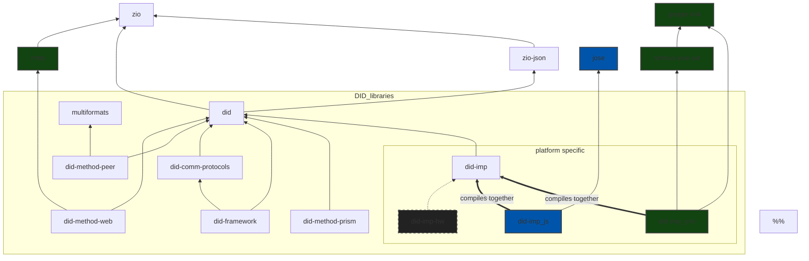
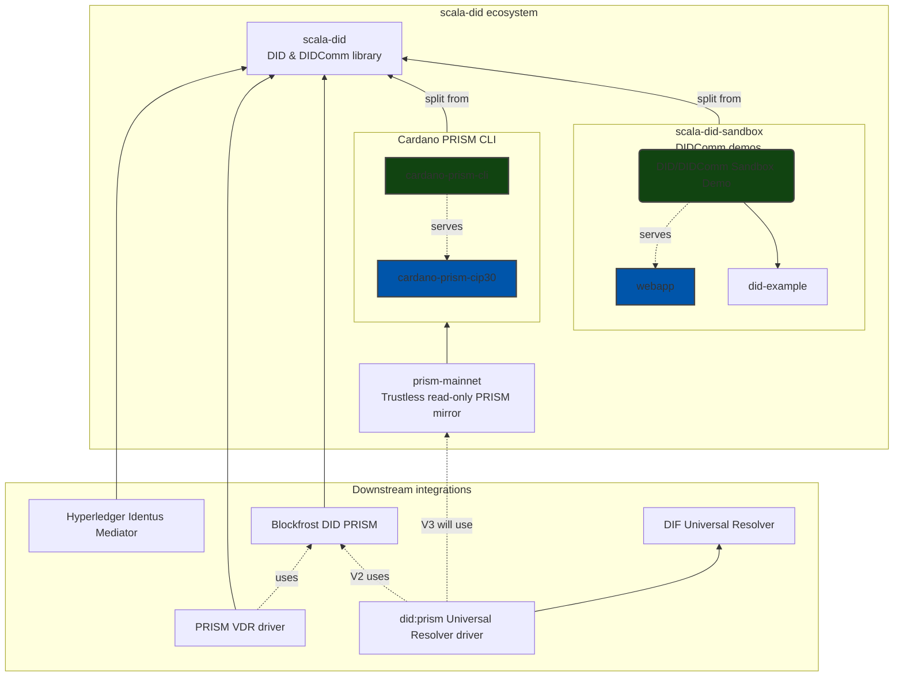

# SCALA DID

A Scala/ScalaJS library for DID and DIDcomm.
One of the main goals of this library is to make DID Comm v2 **type-safe** and easy to use.
Made for developers by developers.

[**LIVE DEMO (DIDComm's Sandbox)**](https://did.fmgp.app/)

[**Scala-DID Documentation**](./docs/src/01-about/01-scala-did.md)


[](https://github.com/FabioPinheiro/scala-did/actions/workflows/ci.yml)
[](https://github.com/FabioPinheiro/scala-did/actions/workflows/scala-steward.yml)

[](https://index.scala-lang.org/fabiopinheiro/scala-did/did)
[](https://index.scala-lang.org/fabiopinheiro/scala-did/did)

 - **CI** automates builds and tests all pushes to the master branch as well as all PRs created.
 - **Scala Steward** automates the creation of pull requests for libraries with updated dependencies, saving maintainers time and effort. It can also help ensure that libraries are kept up-to-date, improving their reliability and performance.

The future version of [**DID Comm v2.1**](https://identity.foundation/didcomm-messaging/spec/v2.1/) is being tracked & developed in the branch [`didcomm-v2.1`](https://github.com/FabioPinheiro/scala-did/tree/didcomm-v2.1)

## Quick Start

To get started with scala-did, see our [Quick Start Guide](./docs/src/02-quickstart/02-install-dependency.md) which covers:
- [Setup Environment](./docs/src/02-quickstart/01-setup-environment.md) - Using scala-cli or sbt
- [Install Dependencies](./docs/src/02-quickstart/02-install-dependency.md) - Adding scala-did to your project
- [Basic Examples](./docs/src/02-quickstart/04-basic-examples.md) - Your first DIDs and DIDComm messages

**Minimal example:**
```scala
libraryDependencies += "app.fmgp" %% "did" % "<version>"
libraryDependencies += "app.fmgp" %% "did-imp" % "<version>"
```

For the latest version, check: 

**More documentation:**
- [Full Documentation](https://did.fmgp.app/docs/) - Complete documentation website
- [API Documentation (Scaladoc)](https://doc.did.fmgp.app/api/) - API reference
- [Maven Central Packages](https://central.sonatype.com/namespace/app.fmgp) - Published artifacts
- [Documentation Source](./docs/src/01-about/01-scala-did.md) - Raw documentation files
- [LICENSE](LICENSE) - Apache License, Version 2.0
- [did implementations](did-imp/README.md) - Notes and TODO list
- [multiformats module](multiformats/README.md) - Implementation notes and considerations

## Adopters

Following is a partial list of companies and projects using DID Comm to craft applications.

Want to see your project here? [Submit a PR](https://github.com/FabioPinheiro/scala-did/pulls)

- [DID Comm - Playground](https://did.fmgp.app/)
- [DID Comm Action - Send messages from Github jobs](https://github.com/fabiopinheiro/did-comm-action)
- [PRISM](https://atalaprism.io/)
  - [DID Comm Mediator](https://github.com/input-output-hk/atala-prism-mediator)

## DID Comm - Protocols

See specifications of the implemented [DID Comm Protocols](./docs/src/03-reference/didcomm-protocols.md)

## TODO/WIP

- We are still working on core API.
  - decrypting a file MUST be one of the following combinations: [See this like](https://identity.foundation/didcomm-messaging/spec/#iana-media-types)
- [TODO!] [Message Layer Addressing Consistency](https://identity.foundation/didcomm-messaging/spec/#message-layer-addressing-consistency)
- did-rotation: https://identity.foundation/didcomm-messaging/spec/#did-rotation
  - support `from_prior`
  - support `sub` `iss` on JWT https://datatracker.ietf.org/doc/html/rfc7519
- maybe implement method `did:peer.3` and `did:peer.4`
- [TODO] method `did:key`
- maybe implement method `did:jwk` https://github.com/quartzjer/did-jwk
- maybe implement methods ["KERI lite"](https://docs.google.com/presentation/d/1ksqVxeCAvqLjr67htWZ4JYaSnI8TUZIO7tDMF5npHTo/edit#slide=id.g1ca1fd90f33_0_0)
- be part of the Adopters in https://github.com/sbt/sbt-ci-release/
- Remove field `kty` from `ECPublicKey` and `OKPPublicKey`. Make custom json encoder/decoder
- FIXME The encoder for ProtectedHeader MUST not have the field "className"

## Benefits of type safety

- It would help prevent errors by ensuring that only valid DIDs are used, and that the library does not attempt to perform any invalid operations on them. This could help ensure that the library functions correctly and reliably.

- It would make the code easier to read and understand, by making it clear what types of values are being used and what operations are being performed on them. This could make it easier for developers to work with the library and understand its functionality. **Speeding up the development of applications**

- It could make the library more efficient, by allowing the compiler to optimize the code for working with DIDs. This could make the library run faster and more efficiently.

- It could improve the reliability and correctness of the library, by catching any errors or bugs related to invalid DIDs or invalid operations at compile time. This could save time and effort in the development process and help prevent potential issues in the final library.

I usually say if it compiles it probably also works! 

## Project Structure and Dependencies Graph


```mermaid
flowchart BT

  zhttp --> zio
  did --> zio
  zio-json --> zio
  did --> zio-json
  did-method-web ----> zhttp:::JVM

  subgraph DID_libraries
    did-method-peer --> multiformats
    subgraph platform specific
      did-imp
      did-imp-hw:::Others -.-> did-imp
      did-imp_js:::JS ==>|compiles together| did-imp
      did-imp_jvm:::JVM ==>|compiles together| did-imp
    end
    did-method-web --> did
    did-method-peer --> did
    did-comm-protocols --> did
    did-framework --> did
    did-method-prism ---> did
    did-framework --> did-comm-protocols
    did-imp --> did

  end

  did-imp_jvm:::JVM ----> nimbus-jose-jwt:::JVM --> google-tink:::JVM
  did-imp_jvm:::JVM ---> google-tink

  did-imp_js ----> jose:::JS

%%  subgraph Sandbox
%%    webapp:::JS
%%    demo
%%    %% webapp:::JS --> did-framework
%%    %% demo --> did-framework
%%    %% demo --> did-method-web
%%    %% demo --> did-method-peer
%%    %% webapp:::JS --> did-imp_js
%%    %% webapp:::JS  --> did-method-web
%%    %% webapp:::JS  --> did-method-peer
%%    %% webapp:::JS  --> did-example
%%    %% demo  --> did-example
%%    %% demo -.->|uses\serves| webapp
%%
%%    demo_jvm(demo_jvm\nA server):::JVM ==>|compiles together| demo
%%    demo_jvm  --> did-example
%%
%%    %% did-example  --> did-method-peer
%%    %% did-example  --> did-method-web
%%  end
%%
%%  subgraph Cardano_PRISM
%%    %%cardano-prism-cip30 --> did-method-prism
%%    cardano-prism-cli --> cardano-prism-cip30
%%  end
%%
%%  Cardano_PRISM ---> DID_libraries
%%  Sandbox ---> DID_libraries

  classDef JVM fill:#141,stroke:#444,stroke-width:2px;
  classDef JS fill:#05a,stroke:#444,stroke-width:2px;
  classDef Others fill:#222,stroke:#444,stroke-width:2px,stroke-dasharray: 5 5;

```

NOTES:

- The things inside the group box (fmgp) are implemented on this repository and that are intended to be published as a library.
- Green boxes is JVM's platform specific.
- Blue boxes is JavaScript's platform specific.
- Other boxes are not platform specific.
- The `did-imp-hw` is a idea how to extend for other implementation. Like a hardware/platform specific or with hardware wallet support.
- `did-method-web` & `did-method-peer` & `did-method-prism` are implementations of the respective did methods.

## Ecosystem and Integrations

`scala-did` is the core library in a slowly growing ecosystem of DID, DIDComm, and Cardano PRISM tooling.

### Related projects

  - [cardano-prism-cli](https://github.com/FabioPinheiro/cardano-prism-cli) — A command-line tool for working with Cardano PRISM. This project was split from this repository.
  - [scala-did-sandbox](https://github.com/FabioPinheiro/scala-did-sandbox) — An independent sandbox containing DIDComm demonstrations.
  - [prism-mainnet](https://github.com/FabioPinheiro/prism-mainnet) — A trustless, read-only mirror of PRISM DID data on the Cardano mainnet.

### Downstream integrations

  - [Hyperledger Identus Mediator](https://github.com/hyperledger-identus/mediator) — now part of the [LF Decentralized Trust](https://www.lfdecentralizedtrust.org/) Identus project; it uses `scala-did` for DIDComm functionality.
  - [Universal Resolver driver for `did:prism`](https://github.com/FabioPinheiro/uni-resolver-driver-did-prism) — A `did:prism` driver used by the [Decentralized Identity Foundation
 Universal Resolver](https://github.com/decentralized-identity/universal-resolver).
  - [PRISM VDR Driver](https://github.com/hyperledger-identus/prism-vdr-driver) an implementation of [Generic VDR specification](https://github.com/hyperledger-identus/vdr).
  - [Blockfrost DID PRISM (Cardano data)](https://github.com/FabioPinheiro/prism-vdr) — Indexed `did:prism` data, including DID Documents and related data for PRISM DIDs stored on the Cardano blockchain.


```mermaid
flowchart BT

  subgraph Ecosystem["scala-did ecosystem"]

    scalaDid["scala-did<br/>DID & DIDComm library"]
    prismMainnet["prism-mainnet<br/>Trustless read-only PRISM mirror"]

    subgraph prismCli["Cardano PRISM CLI"]
      %%cardano-prism-cip30 --> did-method-prism
      cardano-prism-cli:::JVM -. serves .-> cardano-prism-cip30:::JS
    end


    subgraph sandbox["scala-did-sandbox<br/>DIDComm demos"]
      webapp:::JS
      demo_jvm(DID/DIDComm Sandbox Demo):::JVM
      demo_jvm --> did-example
      demo_jvm -. serves .-> webapp:::JS
    end

    prismCli -- "split from" --> scalaDid
    sandbox -- "split from" --> scalaDid
    prismMainnet --> prismCli
  end


  
  subgraph Integrations["Downstream integrations"]
    resolver["DIF Universal Resolver"]
    mediator["Hyperledger Identus Mediator"]
    blockfrost_prism["Blockfrost DID PRISM"]
    driver["did:prism Universal Resolver driver"]
    vdr_driver["PRISM VDR driver"]
    
    mediator --> scalaDid
    vdr_driver --> scalaDid
    blockfrost_prism --> scalaDid
    driver --> resolver
    vdr_driver -. "uses" .-> blockfrost_prism
    driver -. "V2 uses" .-> blockfrost_prism
    driver -. "V3 will use" .-> prismMainnet
  end

  Integrations ~~~~ Ecosystem

  classDef JVM fill:#141,stroke:#444,stroke-width:2px;
  classDef JS fill:#05a,stroke:#444,stroke-width:2px;
```


