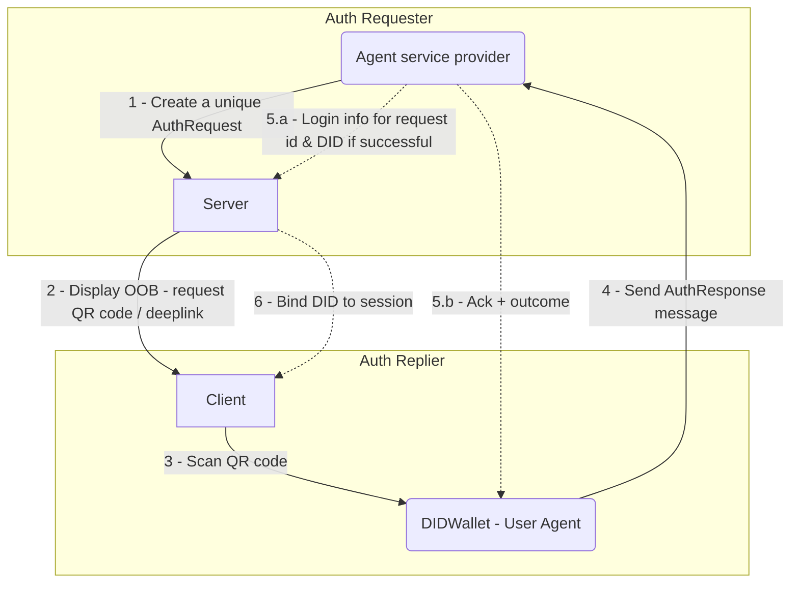
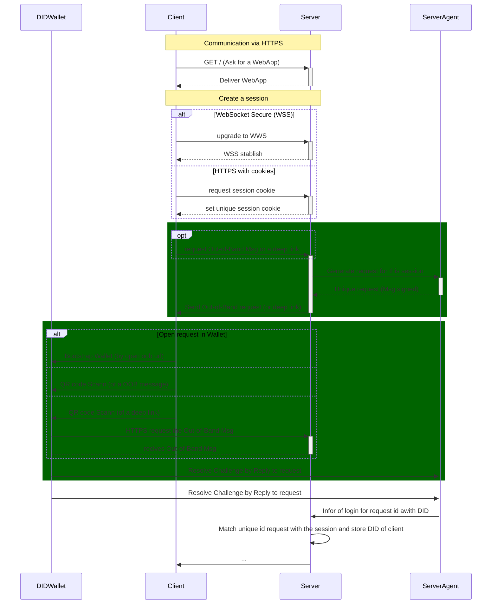
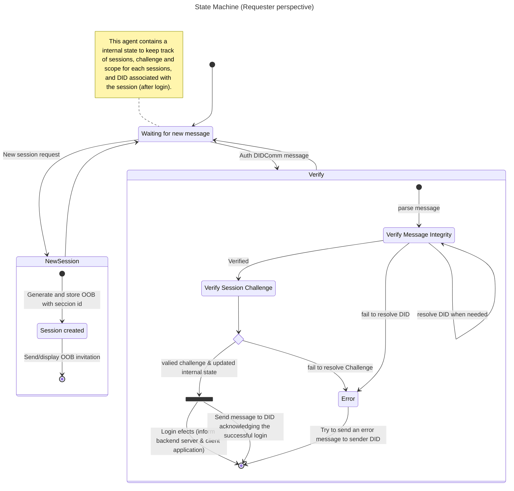

# Auth Protocol

This specification defines a DIDComm v2 protocol that allows a user to authenticate (prove control of a DID) and optionally authorize access to resources in an application (e.g., website, mobile app, or WSS backend). The protocol is transport-agnostic and supports both out-of-band bootstrapping and targeted, per-session requests.

The protocol also aims to bridge the gap between Web2 and Web3. It enables authentication through self-sovereign identities (SSIs) using DIDs, while requiring only minimal changes to existing Web2 applications that already rely on OAuth-style flows.

## PIURI
  
- `https://lace.io/auth/1.0/request`
  - **Invitation to authenticate and authorize** 
    - If this is an out-of-band message it MUST be `signed(plaintext)`
    - If the message is encrypted it MUST be `authcrypt(plaintext)`
  - Ex: can be used to authenticate a WebSocket Secure (WSS), or session cookies in a website.

- `https://lace.io/auth/1.0/msg`
  - **Reply to request**
  - for register opetations we can use `signed(plaintext)`; `anoncrypt(sign(plaintext))`; `authcrypt(sign(plaintext))`
    -  this small search for accountability. A way for the server to prove that login was requested. This may enable specific use cases. E.g. the service provider may be required to keep records in specific use cases.
  - for unregister operation we can use `authcrypt(plaintext)`, by default this encrypted mode will not be accepted.

### Roles

- Auth Requester
  - **Agent server side** - The DIDComm agent operated by the relying party (RP) that generates an authentication request for any or a specified DID to create a client session..=
    Usually a well-known agent that provides a service.
  - **Application server side** - The RP’s web/app backend that manages session state and consumes the authentication result to correlates session with DIDs.
- Client
  - **Application client side** - The user agent (typically a browser or native app) initiating the sign‑in flow with the RP.
  - **Agent client side(e.g. Identity Wallet)** - The user’s DID wallet or agent. It receives authentication requests, displays them to the user, produces signed responses (proofs), and communicates them back to the agent in the server.

## Terminology

- **Authentication** — The process of verifying identity (in this protocol, proving control of a DID).
- **Authorization** — The process of determining what resources a user is allowed to access.

### Messagem Flow Diagram (Example)

#### Example of Sequence Diagram

## Example of a state machine of the participants

## Notes

- The `Client` will most likely be a browser. But the application webpage running on it is developed/chosen by the one that is trying to authenticate.
- The `DIDWallet` represents the identity wallet. It can be a mobile application or a browser extension, etc. It's something that belongs to the user that will be authenticated. User is the owner and one that chooses its wallet.
  - There is a need to define a well known standard API to allow the communication between the client application (website/DApp) to the identity wallet. Something similar to [CIP-30](https://cips.cardano.org/cip/CIP-30) for a QR code with a OOB message.
- The communication between the Agents (`DIDWallet` and `ServerAgent`) is designed to be Done over DIDComm V2. It can be done directly or indirectly or a mix.
  - The typical scenario that mimics the OAuth flow is for the challenge/request OOB message (request to authenticate) to be sent from the `ServerAgent` to the `DIDWallet` indirectly via the website/DApp then show via a QR code or via browser extension bridge. The reply would be typical sent directly from the `DIDWallet` to the `ServerAgent` using the for DIDCommService of the requester.