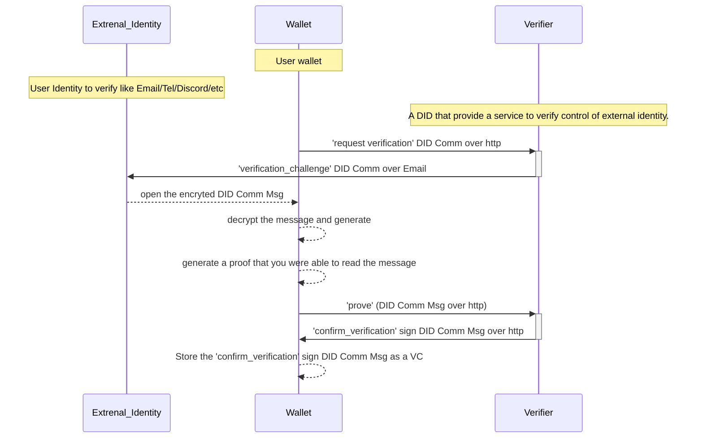

# Prove Control Protocol

This protocol is used a proof control of external identities.


- **Verifier** - The Verifier is a well-known DID that is trusted and the provides a verification service. It will challenge the User to prove the control over other identity. It then issues a statement (VC) as the User was control over that external identity.
- **User** - The User is another DID that they have other identities (like an email) and wants to prove control over it.

## Type verification_type:
  - Email (read)
    > User proof is able to read email on a specific email address. By receiving an email that contains an encrypted message for the User, which the user can create the message `prove` to send directly Verifier. <span style="color:red">Note: it can be a shared email</span>
  - Domain
    > User proof that it's in control of the Domain by being able to edit the content in the DNS server.
      By creating a new entry of the type `TXT` when the key is the `id` of the message `verificationchallenge`, and the value is the `proof` of the message `prove`.
  - Discord (read)
    > User proof is able to read direct message on a specific account.
  - Tel (read)
    > User proof that the able to receive SMS to a specific number.
    <span style="color:red">Note: An encrypted message is probably too big for a SMS</span>
  - DID
    > User proof is in possession of the private keys of (other) DID by reading and signing a statement with one of those keys.
  - IP (read)
    > <span style="color:red">Note: The IP probably too ephemeral</span>
  - Address (read)
    > User proof is able to receive physical mail. Like Google use case to verify shop owners.

## message structure

- fmgp.app/provecontrol/1/requestverification
  > This message is a request from the User to Verifier. To start the verification process over some specific subject (liek an email address, a domain, etc)
  - `to`
  - `from`
  - `verification_type`
  - `subject`
- fmgp.app/provecontrol/1/verificationchallenge
  > This is encrypted message from the Verifier to the User. That challenge the User according to the `verification_type`.
  - `to`
  - `from`
  - `verification_type`
  - `subject`
  - `secret` (only the 'to' can see, because the message is encrypted)
- fmgp.app/provecontrol/1/prove
  > This message is from the User to the Verifier.
  - `to`
  - `from`
  - `verification_type`
  - `subject`
  - `proof`
- fmgp.app/provecontrol/1/confirmverification
  > This is a sign message from the Verifier to the User. It works like a VC verifiable credential. It's a statement from the Verifier that confirms that the User proofed the `verification_type` about the subject to him. The user can use this statement (VC) to show other DIDs that trust this Verifier.
  - `to`
  - `from`
  - `verification_type`
  - `subject`

## Calculate Proof

The `proof` is a string (in the message `prove`) that can only be generated. From the decrypted `verificationchallenge` message type.

Should be calculated according to the following:

```scala
def calculateProof(
    verifier: DIDSubject, // TO in Prove == FROM in VerificationChallenge
    user: DIDSubject, // FROM in Prove == TO in VerificationChallenge
    verificationType: VerificationType,
    subject: String,
    secret: String, 
) = SHA256.digestToHex(s"$verifier|$user|$verificationType|$subject|$secret")
```


## Flow

1. `User -> Verifier` (optional) : requestverification
2. `User <- Verifier` : verificationchallenge
3. `User -> Verifier` : prove
4. `User <- Verifier` : confirmverification


