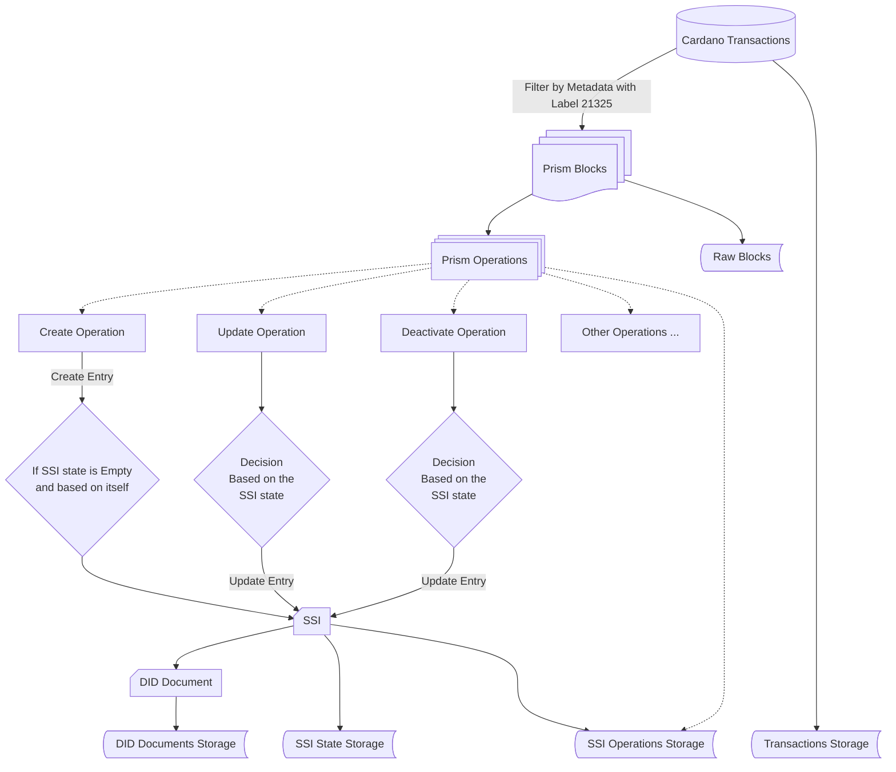

# PRISM VDR Indexer

## DID PRISM

https://github.com/input-output-hk/prism-did-method-spec/blob/main/w3c-spec/PRISM-method.md

## Indexer Architecture

rm cardano-21325
rm prism-operations
rm -rf diddoc
rm -rf opid
rm -rf ops
rm -rf ssi

mkdir diddoc
mkdir opid
mkdir ops
mkdir ssi