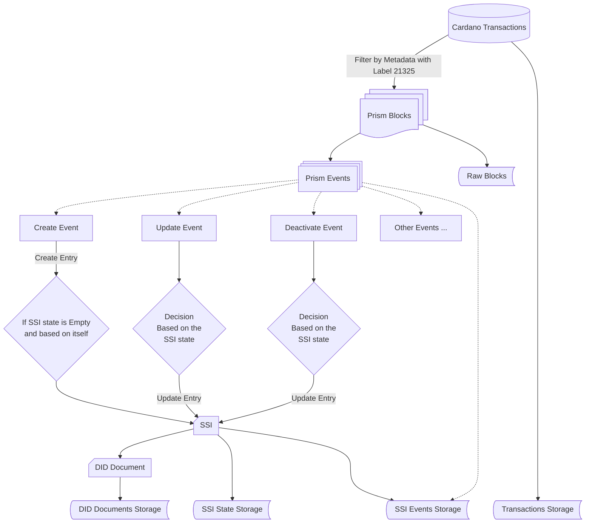

# PRISM VDR Indexer

## DID PRISM

https://github.com/input-output-hk/prism-did-method-spec/blob/main/w3c-spec/PRISM-method.md

## Indexer Architecture

```mermaid
flowchart TD
  Cardano@{ shape: cyl, label: "Cardano Transactions" }
  Blocks@{ shape: docs, label: "Prism Blocks" }
  Events@{ shape: processes, label: "Prism Events" }

  OpCreate@{ shape: rect, label: "Create Event" }
  OpUpdate@{ shape: rect, label: "Update Event" }
  OpDeactivate@{ shape: rect, label: "Deactivate Event" }
  OpOther@{ shape: rect, label: "Other Events ..." }

  OpCreateD@{ shape: diamond, label: "If SSI state is Empty\n and based on itself" }
  OpUpdateD@{ shape: diamond, label: "Decision\n Based on the\n SSI state" }
  OpDeactivateD@{ shape: diamond, label: "Decision\n Based on the\n SSI state"}


  SSI@{ shape: notch-rect, label: "SSI" }
  DID@{ shape: notch-rect, label: "DID Document" }

  SSI_Op@{ shape: bow-rect, label: "SSI Events Storage" }
  SSI_State@{ shape: bow-rect, label: "SSI State Storage" }
  DID_DB@{ shape: bow-rect, label: "DID Documents Storage" }
  Transactions@{ shape: bow-rect, label: "Transactions Storage" }
  RawBlocks@{ shape: bow-rect, label: "Raw Blocks" }
  

  Cardano --Filter by Metadata with Label 21325--> Blocks
  Blocks --> Events
  Blocks --> RawBlocks
  Events -.-> OpCreate & OpUpdate & OpDeactivate & OpOther

  OpCreate --Create Entry--> OpCreateD
  OpCreateD --> SSI

  OpUpdate --> OpUpdateD
  OpUpdateD --Update Entry--> SSI

  OpDeactivate --> OpDeactivateD
  OpDeactivateD --Update Entry--> SSI
  

  SSI --> DID
  DID --> DID_DB
  SSI ---> SSI_State
  SSI ---> SSI_Op
  Events -.-> SSI_Op

  Cardano --------> Transactions

```

