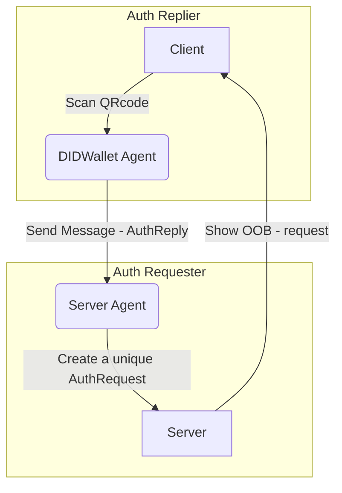
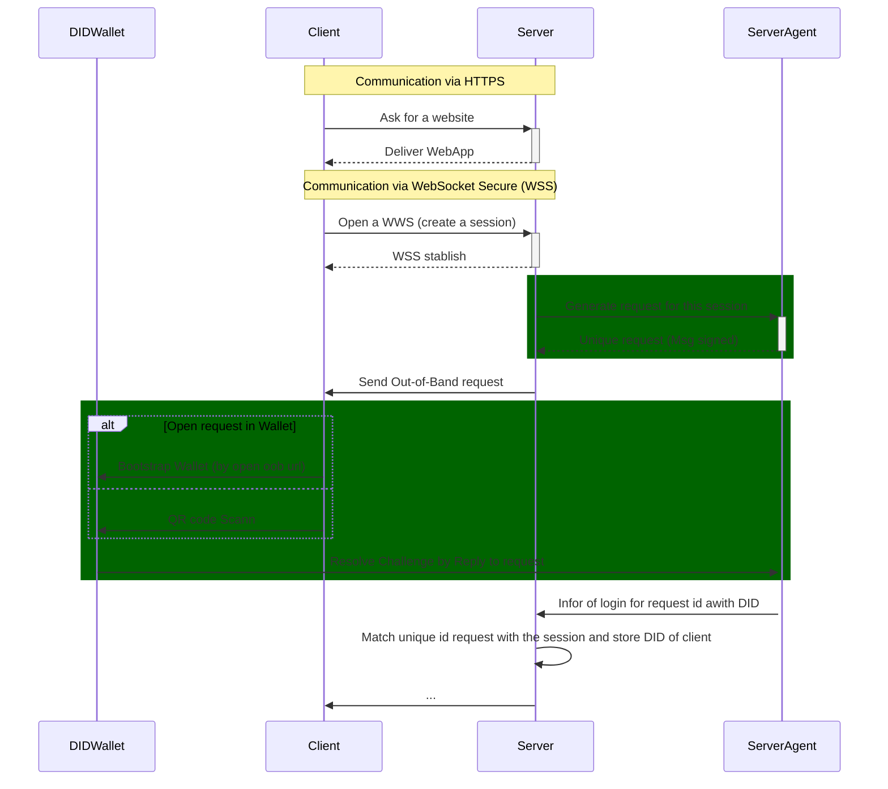

# Auth Protocol

This can be an out-of-band style protocol but can also be dedicated to a user.

This protocol is used a authenticate and or authorization an user (DID) or operations.

- **Authentication** - verifies DID
- **Authorization** - determines what resources a user can access

## PIURI
  
- `https://fmgp.app/auth/1.0/request`
  - **Invitation to authenticate and authorize** 
    - If this is an out-of-band message it MUST me `signed-(plaintext)`
    - If the message is encrypt it MUST be `authcrypt(plaintext)`
  - Ex: can be used to autenticate a WebSocket Secure (WSS)

- `https://fmgp.app/auth/1.0/reply`
  - **Mediate Reply**
  - for register opetations we can use `signed(plaintext)`; `anoncrypt(sign(plaintext))`; `authcrypt(sign(plaintext))`
  - for unregister operation we can use `authcrypt(plaintext)`, by default this encrypted mode will not be accepted.

### Roles

- Server
  - The DID Comm agent (server) that invite to create a session
- Client
  - The DID Comm agent that want to start the session (by login with is DID).

### Messagem Flow Diagram (Example)

#### Example of Sequence Diagram

