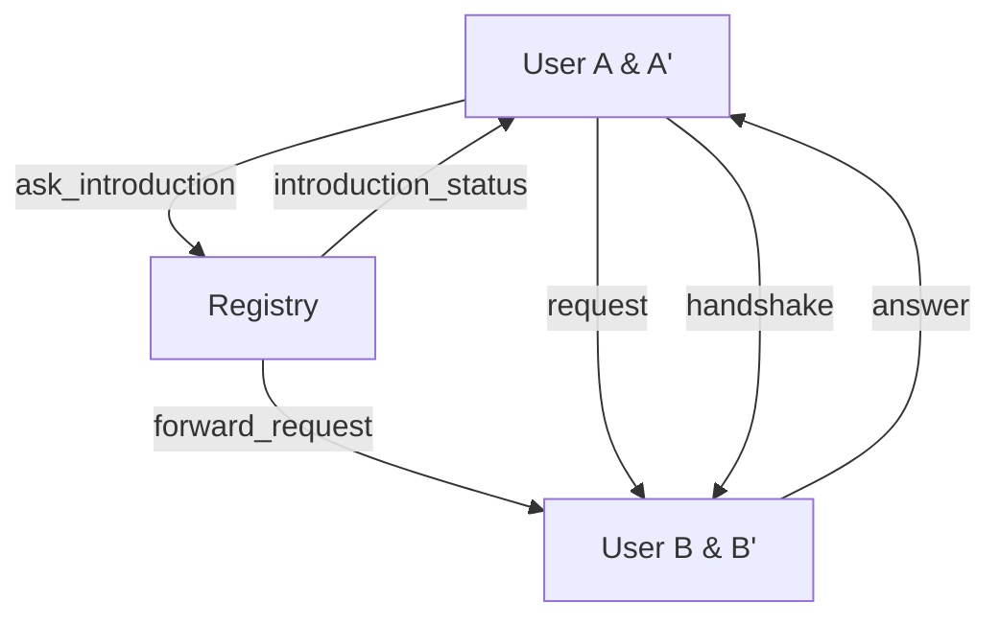
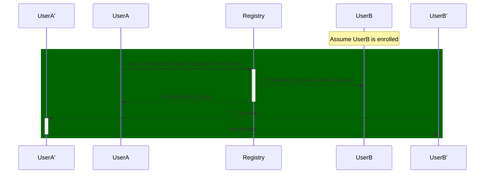
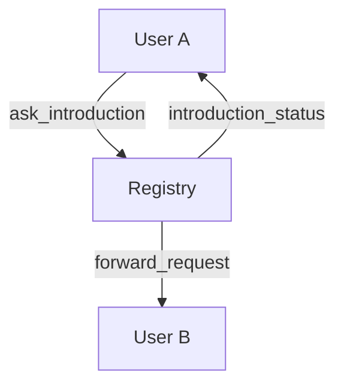

# Discovery Protocol

- **Registry** - A DID that provide other service to users (DIDs)
- **User** - The user (DID) that is trying to use the register service

## PIURI

- `https://decentriqube.com/discovery/1/ask_introduction`
- `https://decentriqube.com/discovery/1/introduction_status`
- `https://decentriqube.com/discovery/1/forward_request`
- `https://decentriqube.com/discovery/1/request`
- `https://decentriqube.com/discovery/1/answer`
- `https://decentriqube.com/discovery/1/handshake`

### Flow:

#### Example of Sequence Diagram

- `*` - If the conditions verify
- `**` - If the user decides to reply

## message structure

- `ask_introduction`
  - from (enroll DID)
  - to (registry)
  - attachment:
    - (signed `https://decentriqube.com/discovery/1/request`)

- `introduction_status`
  - from (registry)
  - to (to the one ask_introduction)
  - thid
  - body:
    - forward_request_sent: Boolean

- `forward_request`
  - from
  - to
  - thid
  - attachment:
    - (signed `https://decentriqube.com/discovery/1/request`)

- `request` (singed message)
  - from (new DID)
  - body:
    - `subject_type` - (Email | Domain | Discord | Tel)
    - `subject`

- `answer` (introduction request)
  - from
  - to
  - thid (id of the `request` its also the challenge)
  - pthid (id of the `forward_request`)

- `handshake`
  - from
  - to