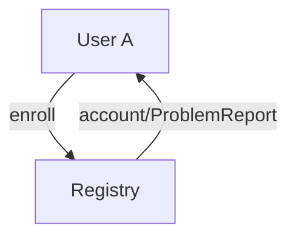
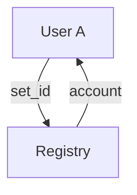
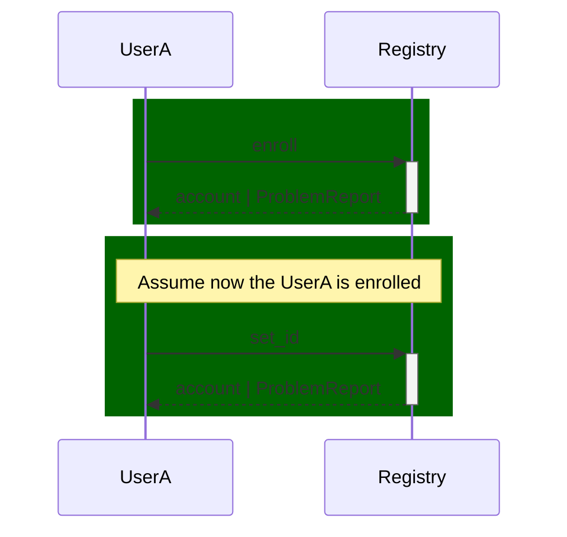

# Registry Protocol


- **Registry** - A DID that provide other service to users (DIDs)
- **User** - The user (DID) that is trying to use the register service

## PIURI
  
- `https://decentriqube.com/registry/1/enroll`
  - **Request from an user to enroll in the Registry service** 
- `https://decentriqube.com/registry/1/account` https://decentriqube.com/user-registry/1/handshake_accepted
  - **State of the user in the registry**
- `https://decentriqube.com/registry/1/set_id`
<!-- - `https://decentriqube.com/registry/1/remove_id` -->


### Flow:

```
'enroll' -> 'account|ProblemReport'
'set_id' -> 'account|ProblemReport'
```





#### Example of Sequence Diagram



## message structure

- `enroll`
  - from
  - to

- `account`
  - from
  - to
  - thid
  - body:
    - ids: Seq[(SubjectType, String)]

- `set_id` (edit maybe?) how to remove?
  - from
  - to
  - body:
    - subjectType - (Email | Domain | Discord | Tel)
    - subject
    - proof
