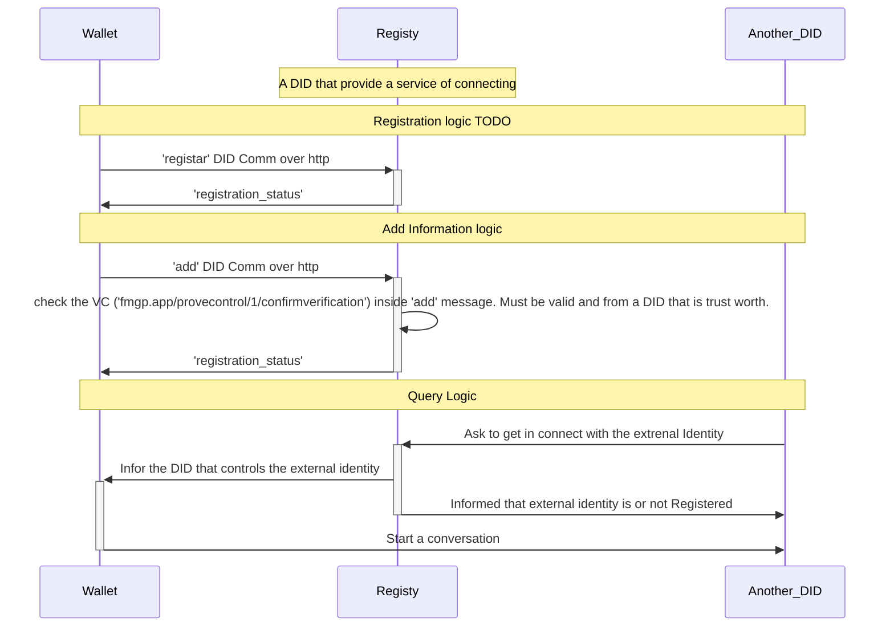

# User Register Protocol

TODO 

## User Registration process of Extrenal Identity

```mermaid
sequenceDiagram
  participant W as Wallet
  participant R as Registy
  participant O as Another_DID
  
  Note over R: A DID that provide a service of connecting
  
  %% rect rgb(191, 180, 255)
    Note over W,O: Registration logic TODO
    W->>+R: 'registar' DID Comm over http
    R->>-W: 'registration_status'

    Note over W,O: Add Information logic 
    W->>+R: 'add' DID Comm over http
    R->>R: check the VC ('fmgp.app/provecontrol/1/confirmverification') inside 'add' message. Must be valid and from a DID that is trust worth.
    R->>-W: 'registration_status'
  %% end

  %% rect rgb(191, 223, 200)
    Note over W,O: Query Logic
    O->>+R: Ask to get in connect with the extrenal Identity
    R->>+W: Infor the DID that controls the external identity
    R->>-O: Informed that external identity is or not Registered
    W->>-O: Start a conversation
  %% end

%%   rect rgb(191, 180, 255)
%%   end

%%   rect rgb(250, 223, 200)
%%     loop Do (M) Operations
%%     end
%%   end
```